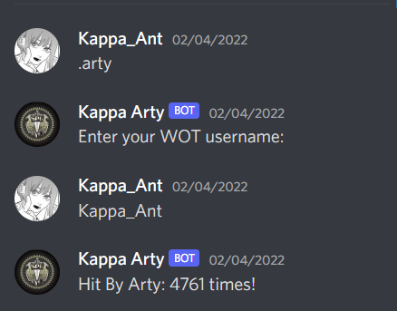

APIS:

https://developers.wargaming.net/reference/all/wot/account/info/?application_id=51f802fc0bedd0f40e870f80387ba919&account_id=1018310989&r_realm=na&run=1

(and discord bot API)

Summary of Program: Asks user for account name and fetches the data of artillary shells recieved for that account.

Commands:

.arty - fetching name and data

* 

Note: This bot runs on Heroku for free and will shut off every other month. 
      *Token protected using environment variables on Heroku
